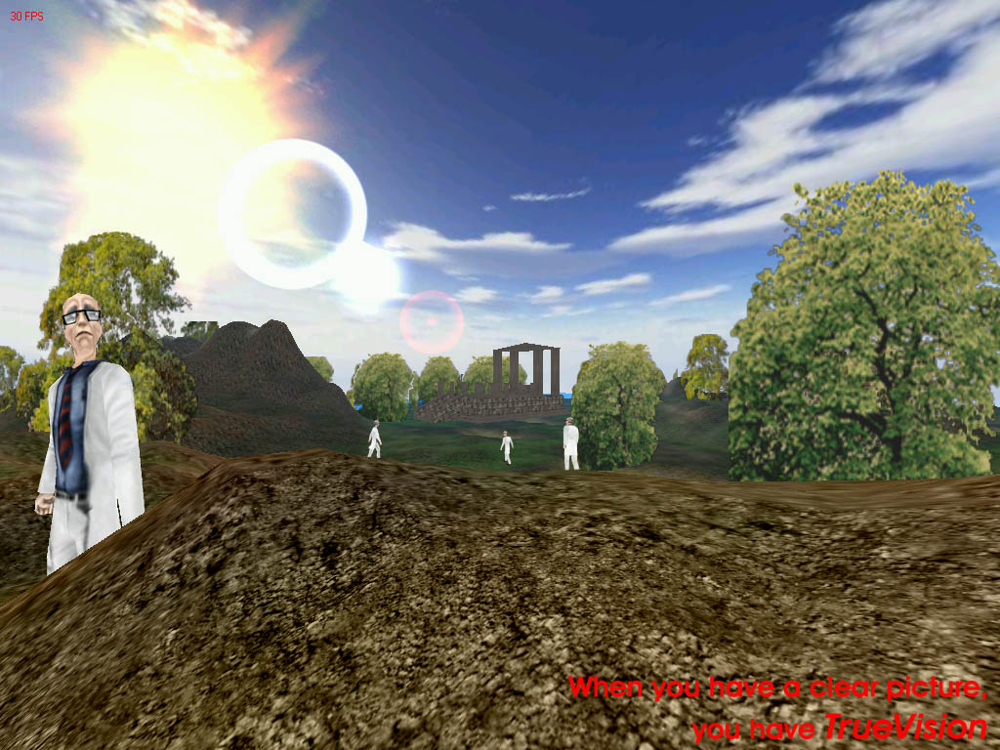



## TrueVision3D Engines Landscape Example

### Description

This sample is 1 of the great TrueVision3D samples with Realistic 3D and with a high frame rate per second.

This example shows you what you can do with the TrueVision3D engines, but it's still a small example if you know TrueVision3D.

To test this example then you'll need to download the TrueVision3D engine(s) at: http://www.TrueVision3DSDK.com

And if you need help or if you have any question then look at the TrueVision3D forum.

(Please make sure that you have read the agreements(terms of use) if you use TrueVision3D for a game or any other application/software)
 
### More Info
 
Download first the TrueVision3D engine(s) at: http://www.TrueVision3DSDK.com

(Don't forget to register them in your registery)

             |
---                |---
**Submitted On**   |2001-04-08 15:26:44
**By**             |[TrueVision3D](https://github.com/Planet-Source-Code/PSCIndex/blob/master/ByAuthor/truevision3d.md)
**Level**          |Advanced
**User Rating**    |4.7 (136 globes from 29 users)
**Compatibility**  |VB 5\.0, VB 6\.0
**Category**       |[DirectX](https://github.com/Planet-Source-Code/PSCIndex/blob/master/ByCategory/directx__1-44.md)
**World**          |[Visual Basic](https://github.com/Planet-Source-Code/PSCIndex/blob/master/ByWorld/visual-basic.md)
**Archive File**   |[TrueVision18083482001\.zip](https://github.com/Planet-Source-Code/truevision3d-truevision3d-engines-landscape-example__1-22227/archive/master.zip)

